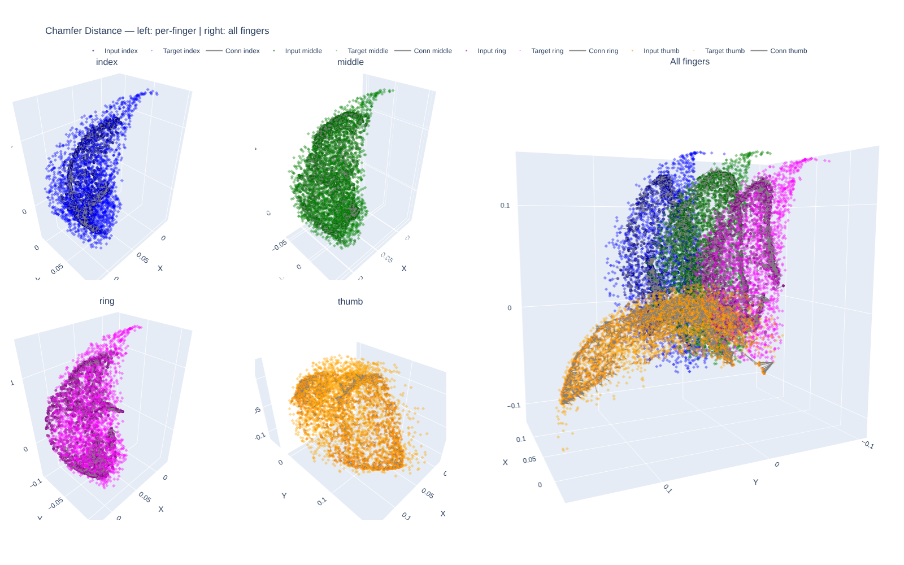

# Glove-Based Teleoperation

Real-time teleoperation of Allegro robotic hands using Manus gloves with rule-based or learning-based retargeting approaches.

This document covers two retargeting methods:
1. **Rule-Based Retargeting** - Heuristic mapping with immediate deployment
2. **GeoRT-Based Retargeting** - Learning-based approach for improved accuracy

---

## Glove Setup (Common for All Methods)

> **Note:** This project uses Manus Core 3 SDK v3.0.0. Later versions should work with minor adjustments.

> [!IMPORTANT]
> **Calibration Recommendation:** For stability, we recommend performing glove calibration on Windows using the MANUS Core application (v3.0.1 or later) and saving the `.mcal` files. These calibration files can then be transferred to your Linux system for use with the ROS2 node. See [Glove Calibration](#glove-calibration) section below for details.

### Prerequisites

- **MANUS Core 3 SDK** (with ROS2 Package): https://docs.manus-meta.com/3.0.0/Resources/
- **Connection Guide**: https://docs.manus-meta.com/3.0.0/Plugins/SDK/ROS2/getting%20started/

### Glove Calibration

Calibration files (`.mcal`) store **skeleton scaling and sensor correction parameters** matched to the user's hand size:

| Item | Without Calibration | With Calibration |
|------|---------------------|------------------|
| Finger length | SDK default values | Scaled to actual user hand size |
| Joint angles | Based on raw sensor data | Corrected for individual ROM |
| Fingertip position | May be inaccurate | Millimeter precision |
| Hand pose reproducibility | Low | High |

#### How Calibration is Applied in ROS2

When the `manus_data_publisher` node runs, calibration files are loaded into the MANUS SDK, and **all published data is output in a calibrated state**.

```
MANUS Glove (Hardware)
        ↓
   Raw Sensor Data
        ↓
┌─────────────────────────────────────────────┐
│  MANUS SDK (CoreSdk_SetGloveCalibration)    │
│  ← humanLeftMetaglove.mcal loaded           │
│  ← humanRightMetaglove.mcal loaded          │
│  (calibration files exported from Windows)  │
│                                             │
│  Skeleton calculation with calibration      │
└─────────────────────────────────────────────┘
        ↓
   Calibrated Data
        ↓
┌─────────────────────────────────────────────┐
│  manus_data_publisher (ROS2 Node)           │
│  → /manus_glove_left                        │
│  → /manus_glove_right                       │
└─────────────────────────────────────────────┘
        ↓
   ROS2 Topics (calibration-applied data)
```

#### Calibration Application in Code

**1. Calibration file loading and SDK application** (`ManusDataPublisher.cpp:593-598`):
```cpp
SDKReturnCode t_Res = CoreSdk_SetGloveCalibration(
    t_GloveId,
    t_CalibData->data(),      // Binary data from .mcal file
    static_cast<uint32_t>(t_CalibData->size()),
    &t_Result
);
```

**2. Receiving calibrated skeleton data** (`ManusDataPublisher.cpp:655`):
```cpp
// SDK internally returns data with calibration applied
CoreSdk_GetRawSkeletonData(i, t_NxtClientRawSkeleton.nodes.data(), ...);
```

**3. Publishing as ROS2 messages** (`ManusDataPublisher.cpp:337-351`):
```cpp
// These position/orientation values have calibration applied
t_Pose.position.x = t_Pos.x;
t_Pose.position.y = t_Pos.y;
t_Pose.position.z = t_Pos.z;
t_Pose.orientation.x = t_Rot.x;
// ...
t_Msg.raw_nodes.push_back(t_Node);
```

#### ROS2 Message Fields with Calibration Applied

The following fields in the `ManusGlove` message contain calibration-corrected values:
- `raw_nodes[].pose.position` - Position of each finger joint (scaled to hand size via calibration)
- `raw_nodes[].pose.orientation` - Rotation of each finger joint (joint angle corrected via calibration)
- `ergonomics[].value` - Finger flexion/extension values (corrected to individual ROM via calibration)

### Verification

After building, run `manus_data_viz.py` to verify glove connection:

```bash
python3 manus_data_viz.py
```

You can check the expected results in the [official visualization guide](https://docs.manus-meta.com/3.0.0/Plugins/SDK/ROS2/visualization/).

**Directory Structure**

```
ROS2/
├── manus_ros2
│   ├── client_scripts
│   │   └── manus_data_viz.py
│   ├── CMakeLists.txt
│   ├── package.xml
│   └── src
│       ├── manus_data_publisher.cpp
│       ├── ...
│       ├── ManusDataPublisher.cpp
│       └── ManusDataPublisher.hpp
├── manus_ros2_msgs
└── ManusSDK
```

## Hardcode Left/Right Glove Recognition

> [!CAUTION]
> **This step is practically required for this project.** By default, gloves are published as `manus_glove_0`, `manus_glove_1` based on connection order. However, all Python scripts in this project subscribe to `manus_glove_left` and `manus_glove_right` topics. **If you skip this hardcoding step, the scripts will run without errors but will not receive any glove data**, resulting in no robot movement or response.

### Step 1: Find Your Glove IDs

After building the Manus ROS2 packages, run the data publisher:

```bash
ros2 run manus_ros2 manus_data_publisher
```

The Glove ID is automatically printed to the logs every 10 seconds. Wear each glove one at a time and note its ID from the logs to identify left/right.

### Step 2: Modify the Code

Modify line 336 in `ManusDataPublisher.cpp`. Replace the example IDs with your actual glove IDs:

```cpp
auto t_Publisher = m_GlovePublisher.find(t_Msg.glove_id);
if(t_Publisher == m_GlovePublisher.end()){
    rclcpp::Publisher<manus_ros2_msgs::msg::ManusGlove>::SharedPtr t_NewPublisher;

    if(t_Msg.glove_id == 123456789){  // Replace with your left glove ID
        t_NewPublisher = this->create_publisher<manus_ros2_msgs::msg::ManusGlove>("manus_glove_left", 10);
    }
    else if (t_Msg.glove_id == -987654321){  // Replace with your right glove ID
        t_NewPublisher = this->create_publisher<manus_ros2_msgs::msg::ManusGlove>("manus_glove_right", 10);
    }
    else{  // Fallback for unknown gloves
        t_NewPublisher = this->create_publisher<manus_ros2_msgs::msg::ManusGlove>("manus_glove_" +
            std::to_string(m_GlovePublisher.size()), 10);
    }
    t_Publisher = m_GlovePublisher.emplace(t_Msg.glove_id, t_NewPublisher).first;
}
```

After modifying, rebuild the Manus ROS2 packages to apply the changes.

### Result

Once configured, gloves will be published to consistent topic names (`manus_glove_left`/`manus_glove_right`) regardless of connection order, enabling all scripts in this project to work correctly.

---

## Method 1: Rule-Based Retargeting

Heuristic mapping approach for direct glove-to-robot joint transformation with Open3D visualization.

### Usage

#### Step 1: Publish Manus Glove Data

Start the Manus data publisher:

```bash
ros2 run manus_ros2 manus_data_publisher
```

#### Step 2: Run Teleoperation Script

> [!IMPORTANT]
> Before running, source the ROS2 workspace in the Manus SDK directory to access the glove topics:
> ```bash
> cd path/to/ManusSDK/ROS2
> source install/setup.bash
> ```

The main teleoperation script supports both single and dual robot setups.

**Basic Usage:**

```bash
# Single robot (default: controls right hand only)
python glove_based/rule_based_retargeting.py --setup single

# Dual robots (default: controls both hands)
python glove_based/rule_based_retargeting.py --setup dual
```

**Explicit Hand Selection:**

```bash
# Single robot, control left hand
python glove_based/rule_based_retargeting.py --setup single --hands left

# Dual robots, control only right hand
python glove_based/rule_based_retargeting.py --setup dual --hands right

# Dual robots, control only left hand
python glove_based/rule_based_retargeting.py --setup dual --hands left
```

**Command Summary:**

| Command | Result |
|---------|--------|
| `--setup single` | Control right hand only (default) |
| `--setup single --hands left` | Control left hand only |
| `--setup dual` | Control both hands (default) ✨ |
| `--setup dual --hands right` | Control right hand only |
| `--setup dual --hands left` | Control left hand only |

### Implementation Details

#### Main Transformation Function

The core retargeting logic in `rule_based_retargeting.py`:

```python

    def transform_glove_to_allegro(self, glove20, side):
        """
        Transform 20-dim glove ergonomics to 16-dim Allegro joint angles.

        Complete transformation pipeline:
        1. Extract finger values from glove data
        2. Map to Allegro joint angles in degrees
        3. Convert to radians
        4. Apply joint-specific scaling and offsets
        5. Clip to joint limits
        6. Apply EMA smoothing

        Args:
            glove20 (list): 20-dimensional glove ergonomics values
            side (str): Hand side ('left' or 'right')

        Returns:
            np.ndarray: 16-dimensional Allegro joint angles in radians (smoothed)
        """
        # ========================================================================
        # Step 1: Extract finger values from glove data
        # ========================================================================
        thumb_vals = np.array(glove20[0:4], dtype=float)
        index_vals = np.array(glove20[4:8], dtype=float)
        middle_vals = np.array(glove20[8:12], dtype=float)
        ring_vals = np.array(glove20[12:16], dtype=float)

        # ========================================================================
        # Step 2: Construct joint angles in degrees (order: thumb, index, middle, ring)
        # ========================================================================
        angle_deg = np.concatenate([
            # Thumb joints (4 DOF)
            [90 - 1.75 * thumb_vals[1]],     # Thumb CMC joint
            [-45 + 3.0 * thumb_vals[0]],     # Thumb base joint 1
            [-30 + 3.0 * thumb_vals[2]],     # Thumb base joint 2
            [thumb_vals[3]],                 # Thumb tip joint
            # Index finger (4 DOF)
            index_vals,
            # Middle finger (4 DOF: first joint +20°, then 3 more)
            [middle_vals[0] + 20],
            middle_vals[1:],
            # Ring finger (4 DOF: first 3, last +5°)
            ring_vals[0:3],
            [ring_vals[3] + 5],
        ])

        # ========================================================================
        # Step 3: Convert to radians
        # ========================================================================
        arr = np.deg2rad(angle_deg)

        # ========================================================================
        # Step 4: Apply joint-specific scaling and offsets
        # ========================================================================
        # Thumb scaling
        arr[0] *= 2.5                          # Joint 0: MCP Spread
        arr[1] = arr[1] * 2 + np.deg2rad(90)   # Joint 1: PIP Stretch + 90° offset
        arr[3] *= 2                            # Joint 3: DIP Stretch

        # Index finger scaling
        arr[4] *= -0.5   # Joint 4: MCP Spread
        arr[5] *= 1.5    # Joint 5: MCP Stretch
        arr[7] *= 2      # Joint 7: PIP Stretch

        # Middle finger scaling
        arr[8] *= -0.2   # Joint 8: MCP Spread
        arr[9] *= 1.5    # Joint 9: MCP Stretch
        arr[11] *= 2     # Joint 11: PIP Stretch

        # Ring finger scaling
        arr[12] *= 0.1   # Joint 12: MCP Spread
        arr[13] *= 1.5   # Joint 13: MCP Stretch
        arr[15] *= 2     # Joint 15: PIP Stretch

        # ========================================================================
        # Step 5: Clip to joint limits
        # ========================================================================
        arr = np.clip(arr, ALLEGRO_LOWER_LIMITS, ALLEGRO_UPPER_LIMITS)

        # ========================================================================
        # Step 6: Apply exponential moving average (EMA) smoothing
        # ========================================================================
        side_key = side.lower()
        prev_arr = self.prev_arr.get(side_key)

        if prev_arr is None:
            smoothed = arr.copy()
        else:
            smoothed = self.alpha * arr + (1.0 - self.alpha) * prev_arr

        self.prev_arr[side_key] = smoothed

        return smoothed

```

#### Transformation Pipeline Details

The retargeting process consists of 6 steps:

1. **Extract finger values** - Parse 20-dim glove data into finger segments (thumb, index, middle, ring)
2. **Map to joint angles** - Apply heuristic mapping rules to convert glove measurements to Allegro joint angles (degrees)
3. **Convert to radians** - Transform all angles to radians for ROS2 compatibility
4. **Apply scaling** - Apply finger-specific scaling factors and offsets for optimal mapping
5. **Clip to limits** - Ensure all joint values are within safe hardware limits
6. **Smooth output** - Apply exponential moving average (EMA) filter to reduce jitter

---

## Method 2: GeoRT-Based Retargeting

Learning-based approach using GeoRT (Geometric Retargeting) for improved accuracy through data-driven mapping.

### Workflow

1. **Setup Environment** — Create conda environment with required dependencies
2. **Log Human Hand Data** — Record glove motion
3. **Generate Robot Data** — Sample robot kinematics for the FK model + chamfer target
   - **2b (optional)**: Generate self-collision dataset and train the collision classifier — required for the GeoRT collision-free criterion (`--w_collision > 0` during IK training)
   - **2c (optional but recommended)**: Visual verification of URDF / config offsets / base frame
4. **Train IK Model** — Learn geometric retargeting with chamfer + direction + curvature + pinch + (optionally) collision losses
5. **Inference & Deployment** — Replay / real-time / hardware

---

### Step 0: Setup Conda Environment

**System Requirements**

- Ubuntu 22.04
- ROS2 Humble
- Robot hands: **Allegro Hand V4** (4 fingers, 16 DOF) and **v6_right** (5 fingers, 20 DOF). The pipeline is hand-agnostic — any URDF + JSON config under `glove_based/geort/config/` is supported.
- Sapien Simulator 2.2.2
- Python 3.10+

> [!NOTE]
> For 5-finger v6 the `--hand` flag accepts both `v6_right` and `v6_right.json`. v6's URDF includes a `virtual_base` link that re-aligns the wrist-mounted physical base to the GeoRT template convention (X = palm normal, Y = palm→thumb, Z = palm→middle finger) so chamfer matching against Manus mocap (which uses the same convention) works correctly. See `glove_based/assets/v6_right/v6_right.urdf` for the transform definition.

**Installation**

```bash
# Create conda environment
conda create -n geort python=3.10

# Activate environment
conda activate geort

# Install dependencies
pip install -r glove_based/geort_requirements.txt

# Install GeoRT package
cd glove_based
pip install -e .
```

---

### Step 1: Log Human Hand Data

Record human hand motions using the Manus glove for training the retargeting model.

**1.1 Start Manus Data Publisher**

```bash
ros2 run manus_ros2 manus_data_publisher
```

**1.2 Preprocess Glove Data**

Convert raw glove data to 21-joint skeleton format compatible with GeoRT:

```bash
conda activate geort
python glove_based/manus_skeleton_21.py
```

**1.3 Log Human Data**

Record hand motions with specified parameters:

```bash
# Right hand example
python glove_based/geort_data_logger.py --name human1 --handness right --duration 60 --hz 30

# Left hand example
python glove_based/geort_data_logger.py --name human1 --handness left --duration 60 --hz 30
```

**Parameters:**
- `--name`: Human identifier (default: `human1`)
- `--handness`: Hand side (`left` or `right`, default: `right`)
- `--duration`: Recording duration in seconds (default: 60)
- `--hz`: Target frame rate (default: 30)

**Output:** Data saved to `glove_based/data/{name}_{handness}_{timestamp}.npy`

<p align="center">
  
</p>

---

### Step 2: Generate Robot Data

Generate robot kinematics dataset (random qpos + fingertip 3D positions in base frame). This is the FK model's training data and the chamfer target distribution.

```bash
conda activate geort

# Allegro
python glove_based/geort/generate_robot_data.py --hand allegro_right

# v6 (5-finger)
python glove_based/geort/generate_robot_data.py --hand v6_right.json

# Optional: Visualize only (no dataset saved)
python glove_based/geort/generate_robot_data.py --hand v6_right.json --viz
```

**Key Parameters:**
- `--hand`: Hand config name (e.g., `allegro_right`, `v6_right.json`)
- `--num-samples`: Number of samples (default: 1M for generation, 100 for viz)
- `--viz`: Enable visualization mode (slowed to 1s per pose by default)
- `--no-save`: Preview mode (visualize without saving)

**Output:** `glove_based/data/{hand_name}.npz`

> [!IMPORTANT]
> If you modify the URDF (e.g., change joint limits or add a virtual link), **regenerate** this dataset and delete `glove_based/checkpoint/fk_model_{hand}.pth` — otherwise the FK model becomes stale.

---

### Step 2b: Self-Collision Classifier (optional, required if `--w_collision > 0`)

The IK loss can optionally include the **collision-free** criterion from the GeoRT paper (Criterion V):

```
L_col = -E_xH [ log(1 - sigmoid(C(f(xH)))) ]
```

`C` is a small MLP pretrained to predict `P(self-collision | qpos)`. trainer.py uses it as a **frozen, differentiable** proxy for the sapien-based collision check so the IK loss can avoid colliding poses without running PhysX per training batch.

Only needed if you'll train with `--w_collision > 0` (recommended for hands where fingers pack tightly, e.g., v6's 5-finger layout).

**2b.1 Generate collision dataset**

```bash
python glove_based/geort/collision_data.py --hand v6_right.json
```

For each random qpos, the script sets the articulation pose in sapien, steps the scene once (tiny dt, gravity off), and labels the sample collided/free based on whether any link pair penetrates by more than `--min_penetration` (default 2 mm, filters out sub-mm URDF mesh-design artifacts at joint boundaries).

**Key parameters:**
- `--hand`: Hand config name (must match URDF used by trainer.py)
- `--n_samples`: Number of samples (default: 1,000,000)
- `--min_penetration`: Penetration depth threshold in meters (default: 0.002)
- `--strategy`: Sampling strategy. `balanced` (default) mixes single-joint perturbations, K-joint perturbations, and uniform random to give a ~50% collision rate — important for class balance during classifier training. Pure `random` typically yields ~80% collision (uniform random qpos is mostly in collision for tight-packed hands), which hurts the classifier.

**Output:** `glove_based/data/{hand_name}_collision.npz` with `qpos` and `label`.

The script prints collision rate at the end — aim for **20-60%** for a learnable classifier.

**2b.2 Train the classifier**

```bash
python glove_based/geort/collision_classifier.py --hand v6_right.json
```

Trains a 3-layer MLP (input: normalized qpos in [-1, 1], output: 1 logit) with BCE loss and `pos_weight = n_neg/n_pos` for imbalance compensation. Prints per-epoch precision/recall/F1; saves the best-val model.

**Output:** `glove_based/checkpoint/collision_classifier_{hand_name}.pth`

> [!NOTE]
> Whenever you change the URDF (especially joint limits), regenerate the collision dataset and retrain the classifier — otherwise the IK loss penalizes a stale collision boundary.

---

### Step 2c: Visual Verification Tools (optional but recommended)

Before kicking off long training runs, verify that the URDF, config offsets, and base-frame convention are correct.

**`hand_debug.py`** — multi-hand interactive viewer with RGB axis markers (anchored at config's `base_link`) and per-fingertip sphere markers (placed at `link.world * center_offset`, the exact point GeoRT learns):

```bash
# v6 alone — check axes are aligned with template convention, fingertip
# markers sit on the actual mesh tips
python glove_based/geort/env/hand_debug.py --hand v6_right --kinematic --pose zero

# Side-by-side: v6 vs allegro for direct base-frame comparison
python glove_based/geort/env/hand_debug.py --hand v6_right allegro_right --kinematic

# Random cycling (default), physics enabled
python glove_based/geort/env/hand_debug.py --hand v6_right
```

CLI flags:
- `--hand <name> [<name> ...]`: load one or multiple configs into the same scene
- `--kinematic`: snap qpos directly (recommended for verification — avoids PD wobble on dense hands)
- `--pose {random, zero, mid}`: hold a static pose (default `random` cycles every 30 steps). `zero` = fully extended fingers, ideal for offset alignment checks.
- Legacy: `--render-hand {left, right, both}` still maps to `allegro_left`/`allegro_right`.

**`hand_static.py`** — random-colored static link viewer:

```bash
# Any configured hand (used for spotting which link is which / mesh layout)
python glove_based/geort/env/hand_static.py --hand v6_right
python glove_based/geort/env/hand_static.py --hand allegro_right
```

Axes are drawn at the config's `base_link` so v6's `virtual_base` is visible in its corrected orientation.

---

### Step 3: Train GeoRT Model

Train the geometric retargeting model using logged human data.

**Basic Training**

```bash
# Allegro right
python glove_based/geort/trainer.py \
    --hand allegro_right \
    --human_data human1_right_1028_150817.npy

# v6 (5-finger) with collision-aware loss and human-to-robot scale compensation
python glove_based/geort/trainer.py \
    --hand v6_right.json \
    --human_data human3_right_0512_164829.npy \
    --ckpt_tag v6_h3 \
    --scale 0.8
```

**Advanced Training**

```bash
python glove_based/geort/trainer.py \
    --hand v6_right.json \
    --human_data human3_right_0512_164829.npy \
    --ckpt_tag experiment_v1 \
    --w_chamfer 50 \
    --w_curvature 1e5 \
    --w_pinch 0.1 \
    --w_collision 0.1 \
    --scale 0.8 \
    --wandb_project my_geort_project \
    --wandb_entity my_username
```

**Training Parameters:**

*Required:*
- `--hand`: Robot hand config name (e.g., `allegro_right`, `v6_right.json`)
- `--human_data`: Human data filename (in `glove_based/data/`)

*Loss Weights (defaults):* — direction loss has implicit weight 1.0. The other weights are tuned so direction stays relatively influential and Pinch doesn't dominate. Empirically this 1/10-of-paper scaling works better than paper values for this codebase due to differences in loss normalization (our pinch and chamfer formulas already include batch-size multipliers).
- `--w_chamfer` (default `50`) — chamfer distance loss
- `--w_curvature` (default `1e5`) — FK(IK) smoothness penalty
- `--w_pinch` (default `0.1`) — pulls robot fingers together when human fingers are within 1.5 cm
- `--w_collision` (default `0.1`) — pretrained collision classifier proxy (requires Step 2b checkpoint). Set to `0` to disable.

*Human-Robot Scale Mismatch:*
- `--scale` (default `1.0`) — scales human keypoints. Use when human-hand fingertip distance distribution doesn't match the robot's reachable workspace distribution. A quick diagnostic: compare `human_mean_dist / robot_mean_dist` from the kinematics dataset; the inverse is a good starting `--scale`. For v6 + adult-size Manus glove, `--scale 0.8` empirically works well (chamfer's "pull to dense robot region" doesn't fight human extended poses as much).

*Wandb Configuration:*
- `--wandb_project`: Project name (default: `geort`)
- `--wandb_entity`: Username/team (optional)
- `--no_wandb`: Disable wandb logging
- `--ckpt_tag`: Checkpoint tag (default: `''`)

**Output:**
- **Checkpoints**: `glove_based/checkpoint/{human_name}_{robot_name}_{timestamp}_{tag}/`
  - `best.pth` - Model with lowest training loss (automatically tracked, **recommended for deployment**)
  - `last.pth` - Latest model from final epoch
  - `epoch_{N}.pth` - Periodic snapshots (every 100 epochs)
  - `config.json` - Training configuration
- **Monitor**: Wandb dashboard or terminal output
- **Chamfer Visualization**: `glove_based/data/chamfer_{human_name}_{robot_name}.html`
  - Interactive 3D point cloud visualization for qualitative assessment
  - Open in browser to inspect human-robot hand geometry alignment
  - Use with quantitative metrics (loss values) for comprehensive evaluation



**Training Notes:**

*Best Checkpoint Tracking:* Training automatically saves the model with lowest loss as `best.pth` (recommended). Console shows: `→ New best model saved! Loss: X.XXXXe-XX`. All evaluation/deployment scripts use `best.pth` by default; add `--use_last` flag to use `last.pth` instead.

---

### Step 4: Inference & Deployment

#### 4.1 Replay Evaluation (Recorded Data)

Test trained model with pre-recorded human hand data in Sapien simulator.

**Allegro**

```bash
python glove_based/geort_replay_evaluation.py \
    --ckpt human1_right_1028_150817_allegro_right_s10 \
    --hand allegro_right \
    --data human1_right_1028_150817.npy
```

**v6 (recommended: `--kinematic` first for clean IK output verification)**

```bash
python glove_based/geort_replay_evaluation.py \
    --hand v6_right.json \
    --ckpt v6_h3 \
    --data human3_right_0512_164829.npy \
    --kinematic
```

`--ckpt` only needs a unique substring of the checkpoint directory name (no need for the full path or shell wildcards).

**Parameters:**
- `--ckpt`: Substring matching the checkpoint directory under `glove_based/checkpoint/`
- `--hand`: Hand configuration name
- `--data`: Human data filename (in `glove_based/data/`)
- `--use_last`: Load `last.pth` instead of `best.pth` (default: best)
- `--kinematic`: Snap qpos directly each frame, no physics step. Use this to inspect the raw IK output — useful when physics-mode divergence obscures what the model actually predicts.
- `--no_self_collision`: Physics on but filter intra-articulation contacts. Use when the hand collides with itself and PD oscillates (common with dense 5-finger hands).
- `--kp` / `--kd` / `--force_limit`: PD tuning (defaults `400` / `40` / `10`). `kd=40` gives near-critical damping with `kp=400`. Lower `--kp 100 --kd 20` for softer/slower response when the IK target jumps fast.

> [!TIP]
> The viewer tints each link a distinct color (via `color_links` helper) so finger boundaries and self-collision contacts are easier to read visually.

---

#### 4.2 Real-time Simulation (Sapien)

Test trained model with live glove input in Sapien simulator.

**Setup**

```bash
# Terminal 1: Start Manus data publisher
ros2 run manus_ros2 manus_data_publisher

# Terminal 2: Preprocess glove data
python glove_based/manus_skeleton_21.py
```

**Run Real-time Evaluation**

```bash
# Terminal 3: Allegro right
conda activate geort
python glove_based/geort_realtime_evaluation.py \
    --ckpt human1_right_1028_150817_allegro_right_s10 \
    --hand allegro_right

# v6, kinematic verification first (no physics)
python glove_based/geort_realtime_evaluation.py \
    --hand v6_right.json \
    --ckpt v6_h3 \
    --kinematic

# v6, physics on + record collision-resolved motion to disk
python glove_based/geort_realtime_evaluation.py \
    --hand v6_right.json \
    --ckpt v6_h3 \
    --kp 100 --kd 20 \
    --record --record_name v6_h3_with_collision
```

**Parameters:**
- `--ckpt`: Substring matching a checkpoint directory under `glove_based/checkpoint/`
- `--hand`: Hand config name
- `--use_last`: Load `last.pth` instead of `best.pth` (default: best)
- `--kinematic`: Snap qpos directly each frame (no physics). Use for clean IK-output verification.
- `--no_self_collision`: Physics on, intra-hand contacts filtered. Stabilizes hands prone to self-collision oscillation.
- `--kp` / `--kd` / `--force_limit`: PD tuning (defaults `400` / `40` / `10`).
- `--record`: Buffer per-frame motion and dump to `glove_based/data/<name>.npz` on shutdown (Ctrl+C).
- `--record_name`: Output filename stem (default: `realtime_<hand>_<MMDD_HHMMSS>`).

**Recorded `.npz` contents (when `--record`):**

| Key | Shape | Meaning |
|---|---|---|
| `t` | (N,) float64 | wall-clock timestamp per frame |
| `human_points` | (N, 21, 3) | preprocessed glove keypoints (Manus 21-node) |
| `qpos_target` | (N, dof) | raw IK output |
| `qpos_actual` | (N, dof) | qpos after physics resolution (collision pushback, PD damping) |
| `meta` | (1,) object | run metadata: hand, ckpt, kp/kd/force_limit, `kinematic` flag, etc. |

Under `--kinematic`, `qpos_target == qpos_actual` (snap is exact). Under physics mode, the *difference* is the value of this recording — it captures the collision-aware motion the IK alone wouldn't produce.

---

#### 4.3 Real Hardware Deployment

Deploy trained model to physical Allegro hands using GeoRT deployer ROS2 nodes.

**Architecture Overview**

The deployment pipeline consists of:
1. **Manus Mocap Node**: Streams hand pose data from Manus gloves
2. **Manus Skeleton Preprocessor**: Converts glove data to 21-joint skeleton format
3. **GeoRT Deployer**: Runs trained models and publishes commands to robot controllers
   - Loads trained IK models for left and/or right hands
   - Subscribes to preprocessed hand poses (`/manus_poses` or `/manus_poses_{left|right}`)
   - Uses `AllegroCommandForwarder` for controller management:
     - Automatically activates appropriate controllers via `controller_manager`
     - Single robot mode (`two_robots=False`): `/allegro_hand_position_controller/commands`
     - Dual robot mode (`two_robots=True`): `/allegro_hand_position_controller_{r|l}/commands`
   - Performs forward pass through GeoRT model
   - Applies post-processing (reordering, optional calibration)
   - Applies EMA smoothing based on previous command for stable control
   - Applies rate limiting to prevent sudden joint movements
   - Publishes joint commands to Allegro hand controllers
   - Returns to safe base position on shutdown

**Smoothing Mechanism:**
- **EMA Formula**: `smoothed = α × target + (1 - α) × previous_command`
- **α (smoothing_alpha)**: Controls responsiveness (0 = maximum smoothing, 1 = no smoothing)
- **Rate Limiting**: Limits maximum joint angle change per control tick

**Configure PD Gains:**

Before launching the controller, configure the PD gains for optimal performance with this deployment. Edit the PD gains configuration file in your `allegro_hand_ros2` workspace:

```yaml
# File: allegro_hand_ros2/allegro_hand_hardwares/v4/description/config/pd_gains.yaml
p_gains:
  joint00: 1.5
  ...
  joint33: 1.5
d_gain: 
  joint00: 0.1024
  ...
  joint33: 0.1024
```

Reference configuration: [pd_gains.yaml](https://github.com/Wonikrobotics-git/allegro_hand_ros2/blob/main/allegro_hand_hardwares/v4/description/config/pd_gains.yaml)

**Setup**

```bash
# Terminal 1: Start Manus data publisher
ros2 run manus_ros2 manus_data_publisher

# Terminal 2: Preprocess glove data
conda activate geort
python glove_based/manus_skeleton_21.py

# Terminal 3: Launch Allegro hand controller
cd allegro_hand_ros2
source install/setup.bash

# For single hand
ros2 launch allegro_hand_bringup allegro_hand.launch.py

# For dual hands
ros2 launch allegro_hand_bringup allegro_hand_duo.launch.py
```

---

**Option A: Single Hand Deployment**

Deploy to a single Allegro hand using `geort_allegro_deploy_single.py`.

> **Note:** This script uses the same `GeortAllegroDeployer` class from `geort_allegro_deploy.py`, ensuring consistent behavior across single and dual hand deployments.

**Basic Usage:**

```bash
# Right hand deployment
python glove_based/geort_allegro_deploy_single.py \
    --ckpt "human1_right_1028_150817_allegro_right_s10" \
    --side right

# Left hand deployment
python glove_based/geort_allegro_deploy_single.py \
    --ckpt "human1_left_1028_150409_allegro_left_s10" \
    --side left
```

**Advanced Usage:**

```bash
# Deploy with custom smoothing and mocap topic
python glove_based/geort_allegro_deploy_single.py \
    --ckpt "human1_right_1028_150817_allegro_right_s10" \
    --side right \
    --smoothing_alpha 0.7 \
    --loop_hz 100.0 \
    --mocap_topic "/manus_poses_right"
```

**Command Arguments:**

| Argument | Description | Required | Default |
|----------|-------------|----------|---------|
| `--ckpt` | Checkpoint tag for the hand model | Yes | - |
| `--side` | Hand side (left or right) | Yes | - |
| `--mocap_topic` | Manus mocap topic name | No | `/manus_poses_{side}` |
| `--loop_hz` | Control loop frequency in Hz | No | 100.0 |
| `--smoothing_alpha` | EMA smoothing alpha (0..1, 1=no smoothing) | No | 0.9 |
| `--use_last` | Load last checkpoint instead of best | No | False (uses best) |

> **Note:** Single hand deployment uses `AllegroCommandForwarder` with `two_robots=False`, which automatically publishes to `/allegro_hand_position_controller/commands` (no suffix) and activates the controller, suitable for single robot setups.

**Additional ROS2 Parameters:**

The deployer also supports runtime-configurable ROS2 parameters:
- `smoothing_alpha`: EMA smoothing factor (0..1)
- `max_delta`: Maximum joint angle change per tick in radians (0 disables)
- `snap_on_start`: Initialize to target pose directly on first frame
- `loop_hz`: Control loop frequency

---

**Option B: Dual Hand Deployment**

Deploy to both Allegro hands simultaneously using `geort_allegro_deploy.py`.

**Basic Usage:**

```bash
# Deploy both hands
python glove_based/geort_allegro_deploy.py \
    --right_ckpt "human1_right_1028_150817_allegro_right_s10" \
    --left_ckpt "human1_left_1028_150409_allegro_left_s10"
```


**Advanced Usage:**

```bash
# Deploy with custom smoothing
python glove_based/geort_allegro_deploy.py \
    --right_ckpt "human1_right_1028_150817_allegro_right_s10" \
    --left_ckpt "human1_left_1028_150409_allegro_left_s10" \
    --smoothing_alpha 0.7 \
    --loop_hz 100.0
```

**Command Arguments:**

| Argument | Description | Required | Default |
|----------|-------------|----------|---------|
| `--right_ckpt` | Checkpoint tag for right hand model | Yes | - |
| `--left_ckpt` | Checkpoint tag for left hand model | Yes | - |
| `--loop_hz` | Control loop frequency in Hz | No | 100.0 |
| `--smoothing_alpha` | EMA smoothing alpha (0..1, 1=no smoothing) | No | 0.9 |
| `--use_last` | Load last checkpoints instead of best | No | False (uses best) |

**Additional ROS2 Parameters:**

The deployer also supports runtime-configurable ROS2 parameters:
- `smoothing_alpha`: EMA smoothing factor (0..1)
- `max_delta`: Maximum joint angle change per tick in radians (0 disables)
- `snap_on_start`: Initialize to target pose directly on first frame
- `loop_hz`: Control loop frequency

---

**Post-Processing Notes**

Both deployment options use the same `GeortAllegroDeployer` class (defined in `geort_allegro_deploy.py`), ensuring consistent behavior. The class includes a `post_processing_commands()` function that:
- **Step A**: Reorders joints from model output (Index, Middle, Ring, Thumb) to hardware order (Thumb, Index, Middle, Ring)
- **Step B**: Applies optional per-joint calibration adjustments (currently disabled by default)

> **Important**: The Step B calibration adjustments are hardware-specific tweaks that are **optional and not recommended** for general use. By default, these are commented out in the code. Only enable if you observe systematic errors in your specific robot setup.

**Implementation Details:**

Both deployment scripts use the same `GeortAllegroDeployer` class with `AllegroCommandForwarder` for controller management:

- **Single deployment** (`geort_allegro_deploy_single.py`):
  - Imports `GeortAllegroDeployer` class
  - Uses `AllegroCommandForwarder(side=side, two_robots=False)`
  - Controller: `/allegro_hand_position_controller/commands` (no suffix)
  - Automatically activates the controller via controller_manager
  - Suitable for single robot setups

- **Dual deployment** (`geort_allegro_deploy.py`):
  - Defines `GeortAllegroDeployer` class
  - Uses `AllegroCommandForwarder(side=side, two_robots=True)`
  - Controllers: `/allegro_hand_position_controller_r/commands` and `/allegro_hand_position_controller_l/commands`
  - Automatically activates both controllers via controller_manager
  - Suitable for dual robot setups with separate controllers

- **Shared components**:
  - Identical smoothing, rate limiting, and post-processing logic
  - Controller activation and management via `AllegroCommandForwarder`
  - Safe base position return on shutdown
